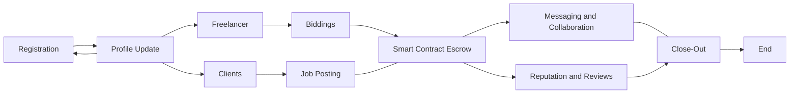

# Kazi Krypto

Description: The use case involves building a freelancing platform on the Ethereum blockchain using ViteJS + React,Infura, MetaMask SDK and Linea Testnet  to enable cross-chain functionality and seamless integration with the Ethereum network. The platform aims to connect freelancers and clients, facilitating secure and transparent transactions while leveraging the benefits of blockchain technology.

## Key Features

1. User Registration and Profiles:
   - Freelancers and clients can create accounts and set up their profiles.
   - Users can provide details such as skills, experience, portfolio, and payment preferences.

2. Job Posting and Bidding:
   - Clients can post job requirements, including project details, scope, budget, and deadlines.
   - Freelancers can browse available jobs and submit bids based on their expertise and desired compensation.

3. Smart Contract Escrow:
   - When a client and freelancer agree on a project, a smart contract is created as an escrow for secure payment handling.
   - Funds are held in the escrow until the project milestones or deliverables are met and approved.

4. Messaging and Collaboration:
   - Integrated messaging system for clients and freelancers to communicate, share project details, and clarify requirements.
   - Collaboration tools for file sharing, version control, and project management.

5. Reputation and Reviews:
   - Users can provide ratings and reviews based on their experience with each other.
   - Reputation scores are calculated based on completed projects, feedback, and timely payments.

6. Multi-Chain Integration:
   - Utilize MetaMask  and Linia to enable seamless integration with various Ethereum-compatible chains (e.g., Ethereum mainnet, testnets, sidechains).
   - Users can choose their preferred chain for transactions, considering factors such as gas fees and transaction speed.

7. Wallet Integration:
   - Integration with MetaMask SDK to enable secure wallet management for users.
   - Users can connect their MetaMask wallets to the application for seamless transaction processing.

8. Payment and Escrow Release:
   - Clients can make payments to the escrow using cryptocurrency (e.g., Ether) or stablecoins (e.g., DAI).
   - Upon successful completion and approval of project milestones, funds are released from the escrow to the freelancer.

9. Dispute Resolution:
   - Mechanism for dispute resolution in case of conflicts between clients and freelancers.
   - Arbitration process utilizing smart contracts and third-party mediators if necessary.

10. Transaction History and Analytics:
   - Users can access a transparent transaction history, including payments made, received, and pending.
   - Analytics and reporting features to track project progress, earnings, and performance metrics.


## KaziKrypto Details 



## Installation and Setup

```bash
git clone https://github.com/TwigaDEVs/kazikrypto.git && \ 
cd kazikrypto
```
...

## Usage
```
cd  web-frontend && npm install
```
```
npm run dev
```

...

## Technologies Used
- solidity
- metamask sdk
- infura
- truffle
- vite

...

## Architecture

This project consists of a Solidity smart contract and a React frontend application that interacts with it via MetaMask.
#### Smart Contract overview

The smart contract is written in Solidity and contains the core logic and state of the application. It is deployed on the Ethereum blockchain. Main functions:
- `addNewFreelancer()` - Allows adding a new freelancer profile  

- `editFreelancerProfile()` - Updates freelancer profile information

- `setProfileVisibility()` - Sets freelancer profile visibility

- `getFreelancer()` - Gets a freelancer's profile

- `addPortfolio()` - Adds project samples to a freelancer's portfolio

- `getPortfolio()` - Gets a freelancer's portfolio item

- `addFreelancerExperience()` - Adds work experience to a freelancer's profile 

- `getExperience()` - Gets a freelancer's experience item

- `postAClientJob()` - Allows a client to post a new job

- `getClientJob()` - Gets all posted client jobs  

- `makeABidding()` - Allows freelancers to bid on a posted job

- `getBid()` - Gets a single bid on a job

- `getBids()` - Gets all bids for a job

- `chat()` - Initiates a chat between freelancer and client

- `markAsRead()` - Marks chat messages from sender as read

- `getChat()` - Gets chat messages

- `getChats()` - Gets all chats with a user

- `acceptBid()` - Client accepts a freelancer's bid on their job 

- `addProjectMilestone()` - Adds a milestone to an accepted bid

- `approveProjectMilestone()` - Approves milestone completion and pays freelancer

- `getFreelancerMileStones()` - Gets a freelancer's milestones  

- `getProjectMileStones()` - Gets milestones for a project

- `getFreelancerTransactions()` - Gets a freelancer's transactions

- `rateAfreelancer()` - Rates a freelancer after job completion

- `viewFreelancerRating()` - Views a freelancer's ratings

- `createDispute()` - Creates a dispute between freelancer and client

- `markDisputeAsResolved()` - Resolves an open dispute

- `getDispute()` - Gets a dispute details

- `getAllDisputes()` - Gets all open disputes
The contract uses events like ValueSet and ValueChanged to emit notifications when state changes.

#### Frontend Overview

The frontend React app provides the user interface and interacts with the deployed smart contract.
#### Key Functions

The frontend UI is built using React and provides forms and views to interact with the smart contract functions:

- Calls contract functions like `addNewFreelancer()` by sending Ethereum transactions using `web3.js` or `ethers.js` libraries.
- For transactions, prompts user to sign using their `MetaMask wallet `.
- Reads data by calling functions like `getFreelancer()` and `getBids()` using call methods.
- Listens for events like `BidAccepted` to update UI instantly.
- Shows transaction history, portfolio etc by querying contract mappings.
- Updates state by calling functions like `editFreelancerProfile()` after taking user input.

#### Connecting to Blockchain

The app connects to the user's Ethereum wallet (MetaMask) to get their account address.
#### Managing State
React hooks are used to manage state and UI logic.
#### Summary

The React frontend provides the UI components and interacts with the Solidity smart contract on Ethereum blockchain to deliver the full decentralized application experience.

#### Testing

    truffle is used to deploy and test the Solidity contracts locally during development.
    react-testing-library for testing components with DOM.

Overall, this architecture allows creating a decentralized app using React for the frontend and Solidity for the core blockchain logic. `MetaMask` and `Infura` provide easy blockchain interactions.

...

## Security Considerations

...
Security was an important consideration in the design of the KaziKrypto smart contract:

- Access control is implemented using modifiers like onlyOwner to restrict privileged functions.
- Sensitive state-changing functions perform appropriate validity checks on inputs and contract state before executing.
- Funds from job posters are held in escrow by the contract until job completion to avoid misuse.
- Job applicants bid for jobs by depositing funds to prevent spamming fake bids.
- Payments are released in milestones agreed upon by both parties to ensure satisfactory progress.
- Disputes can be raised and arbitrated by the contract owner for resolution in cases of conflicts.
- Code is thoroughly commented for readability and logic flow.
- Testing with tools like truffle provides ongoing guardrails during development.
- External security audit of the contract code will be done prior to mainnet deployment.
- A bug bounty program is planned to encourage ethical hacking of the smart contract on testnets.
- Critical bug fixes and improvements will be issued via a formal upgrade and migration process for users.

Adhering to security best practices through the design, implementation, testing and deployment phases is essential for a robust decentralized application.

## Performance and Scalability
The KaziKrypto smart contract is designed to be performant and scalable:

- Data structures like arrays and mappings are used for efficient storage and lookup. For example, allClientJobs array tracks all jobs.
- Most functions have a time complexity of O(1) for reading data by directly accessing mappings. - This allows the contract to scale as data grows.
For iterating over arrays like getting all bids for a job, the complexity is O(n) where n is the number of bids. This can be optimized further with pagination.
- Writing data on blockchain like posting jobs or bidding is more complex and costs gas. So the critical transactional functions use appropriate events to update the frontend UI without needing to read data each time.
- Computationally intensive functions are avoided in the contract. Code is optimized to reduce gas costs.
- To allow scaling the number of users and transactions, the contract data can be migrated to a Layer 2 rollup while still leveraging the security of Ethereum Mainnet.
In the future, using an indexing protocol like The Graph can enable near real-time querying of contract data from the frontend.

Overall, the contract is designed to be efficient and scalable while balancing cost and performance tradeoffs. As adoption increases, further optimizations like data sharding can help scale access.

...

## Testing
- ganache
- npm 
...

## Contributing
Contributions to the KaziKrypto smart contract are welcome! Here are some ways you can help:

    Report bugs and issues on GitHub. Please include steps to reproduce, expected vs actual behavior, and any relevant code.
    Suggest new features and enhancements using the GitHub issues.
    Improve documentation by submitting pull requests with additions, clarifications or fixes.
    Find and submit security vulnerabilities through responsible disclosure.
    Optimize gas usage and improve code efficiency.
    Add test cases to increase code coverage.
    Help translate project content for internationalization.
    Promote the project by publishing articles, tutorials, videos etc.

Pull Requests

Pull requests should target the develop branch. Follow these steps:

    Fork the repo and create your branch from develop.
    Make your code changes following existing styles.
    Ensure CI builds pass and has no conflicts.
    Update documentation as needed.
    Describe PR intent clearly with details.


...

## License
- MIT lisences

...

## Contact Information
- twigadevs@gmail.com

...
